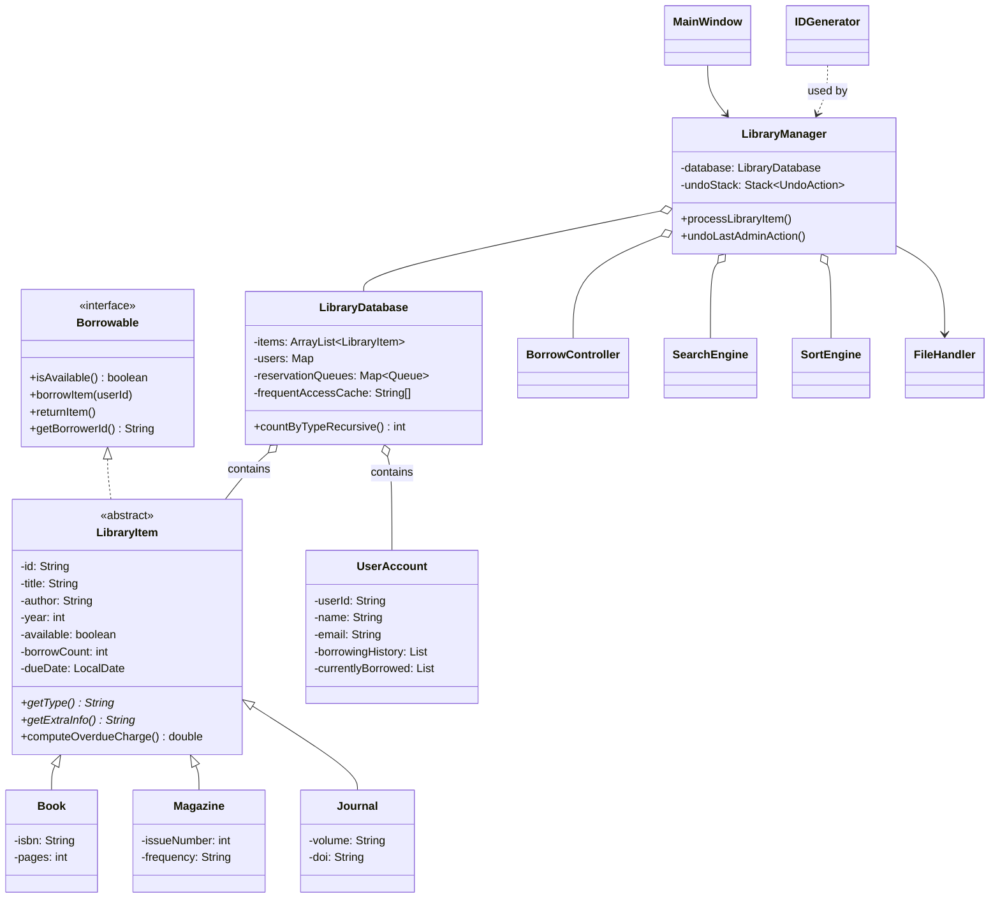

# SLCAS — Class Hierarchy Diagram

## UML (Mermaid)

## Package organisation

| Package | Responsibility |
|---------|----------------|
| `model` | Domain objects and data store |
| `controller` | Business logic, search/sort, borrow workflow |
| `gui` | Swing UI (tabs, tables, dialogs) |
| `utils` | ID generation and file persistence |
