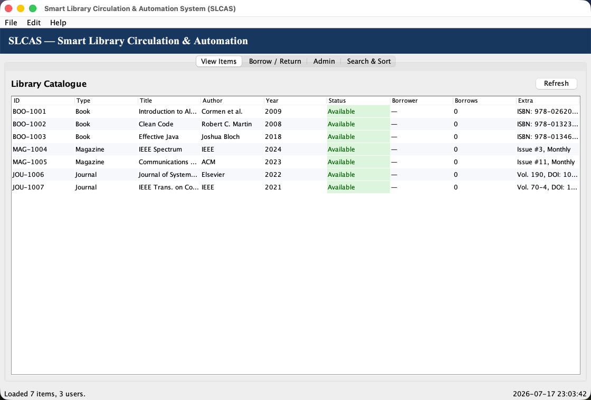
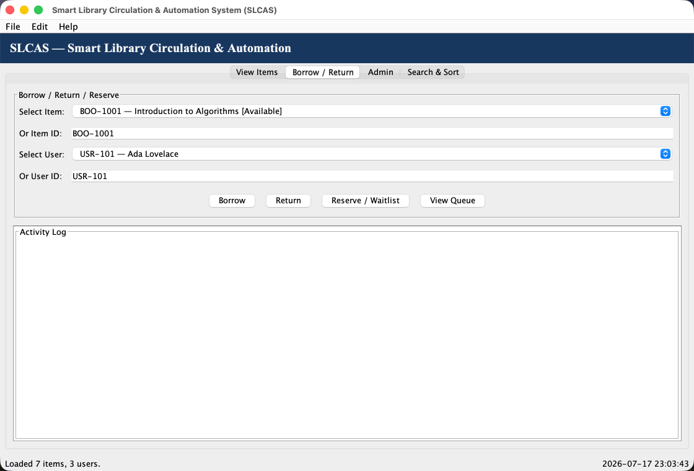
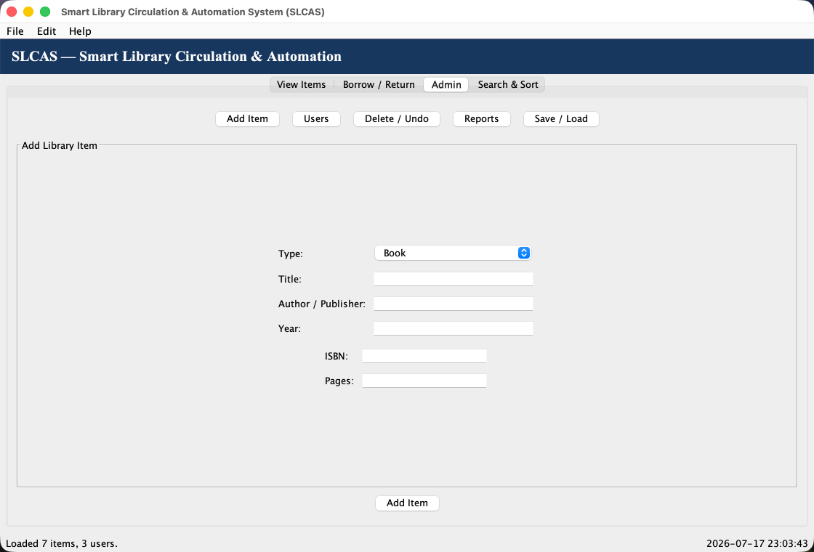
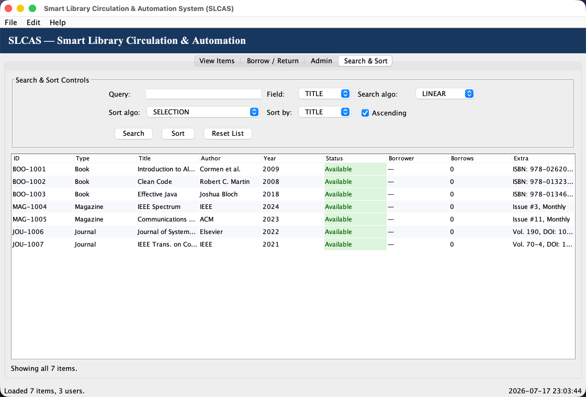

# Smart Library Circulation & Automation System (SLCAS)

Java Swing desktop application for a university library circulation workflow. The system manages library items, users, borrowing and return operations, reservations, search/sort algorithms, reports, and file persistence.

**Course:** COS 202  
**Institution:** MIVA Open University  
**Project:** Smart Library Circulation & Automation System

## Features

- Add and manage library items: books, magazines, and journals
- Register users and track borrowing history
- Borrow, return, and reserve items with a waitlist queue
- Search by title, author, type, or ID
- Sort by title, author, or year using selectable algorithms
- Undo recent admin actions with a stack
- Save and load library data from files
- Generate simple reports for borrowed items, overdue users, and category distribution
- Event-driven Java Swing GUI with multiple tabs, dialogs, menus, shortcuts, timers, and status updates

## GUI Screens

The application has one main window with four required GUI panels:

1. View Items
2. Borrow / Return
3. Admin
4. Search & Sort

Screenshots are available in [`gui-screenshots/`](gui-screenshots/).

| View Items | Borrow / Return |
|---|---|
|  |  |

| Admin | Search & Sort |
|---|---|
|  |  |

## Project Structure

```text
SmartLibrary/
├── src/
│   ├── Main.java
│   ├── model/
│   │   ├── LibraryItem.java
│   │   ├── Book.java
│   │   ├── Magazine.java
│   │   ├── Journal.java
│   │   ├── Borrowable.java
│   │   ├── UserAccount.java
│   │   └── LibraryDatabase.java
│   ├── controller/
│   │   ├── LibraryManager.java
│   │   ├── BorrowController.java
│   │   ├── SearchEngine.java
│   │   └── SortEngine.java
│   ├── gui/
│   │   ├── MainWindow.java
│   │   ├── ViewItemsPanel.java
│   │   ├── BorrowPanel.java
│   │   ├── AdminPanel.java
│   │   ├── SearchSortPanel.java
│   │   └── ItemTableModel.java
│   └── utils/
│       ├── IDGenerator.java
│       └── FileHandler.java
├── gui-screenshots/
├── tools/
│   └── GuiScreenshotRunner.java
├── CLASS_HIERARCHY.md
├── REPORT.md
├── SUBMISSION_CHECKLIST.md
├── run.sh
└── README.md
```

## Requirements Coverage

| Assignment requirement | Implementation |
|---|---|
| Abstract `LibraryItem` | `src/model/LibraryItem.java` |
| `Book`, `Magazine`, `Journal` subclasses | `src/model/` |
| `Borrowable` interface | `src/model/Borrowable.java` |
| Polymorphism | `LibraryManager.processLibraryItem(...)` |
| `LibraryDatabase` composition | `src/model/LibraryDatabase.java` |
| `UserAccount` with borrowing history | `src/model/UserAccount.java` |
| ArrayList | Main catalogue store |
| Queue | Reservation/waitlist per item |
| Stack | Undo admin action history |
| Fixed-size array cache | Most frequently accessed item IDs |
| Linear, binary, recursive search | `src/controller/SearchEngine.java` |
| Selection, insertion, merge, quick sort | `src/controller/SortEngine.java` |
| Recursive component | Recursive search, recursive category count, recursive overdue charge |
| Event-driven GUI | Swing listeners in GUI panels |
| GUI tabs | View Items, Borrow / Return, Admin, Search & Sort |
| Advanced GUI techniques | Renderers, dynamic fields, file chooser, timers, validation, shortcuts, tooltips |
| Persistence | `src/utils/FileHandler.java` |
| Reports | Admin panel report screen |

## How To Run

### macOS with Homebrew OpenJDK

```bash
cd SmartLibrary
export PATH="/opt/homebrew/opt/openjdk/bin:$PATH"
./run.sh
```

### Manual Compile and Run

```bash
javac -d out $(find src -name "*.java")
java -cp out Main
```

The app creates `data/library_data.txt` when data is saved. If no saved data exists, it loads sample demo data on startup.

## Generate GUI Screenshots

The repository includes a small helper that opens the Swing app and captures the four main GUI tabs.

```bash
export PATH="/opt/homebrew/opt/openjdk/bin:$PATH"
javac -d out $(find src -name "*.java")
javac -cp out -d out tools/GuiScreenshotRunner.java
java -cp out GuiScreenshotRunner gui-screenshots
```

## Submission Files

Recommended submission package:

- PDF report containing the description, features, data structures, algorithms, screenshots, and UML/class hierarchy
- GitHub repository link for full source code
- Optional ZIP file of the source folder if the portal accepts extra files

See [`SUBMISSION_CHECKLIST.md`](SUBMISSION_CHECKLIST.md) for a concise checklist.

## Documentation

- [`REPORT.md`](REPORT.md): 2-3 page project report content
- [`CLASS_HIERARCHY.md`](CLASS_HIERARCHY.md): UML-style Mermaid class diagram
- [`SUBMISSION_CHECKLIST.md`](SUBMISSION_CHECKLIST.md): final submission checklist

